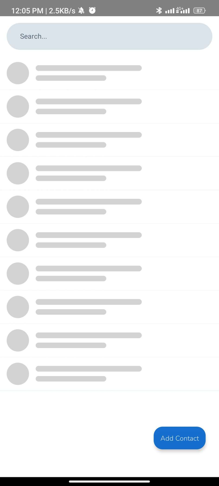
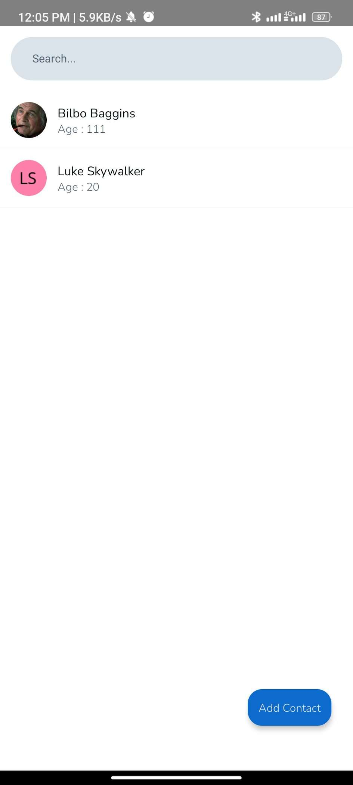
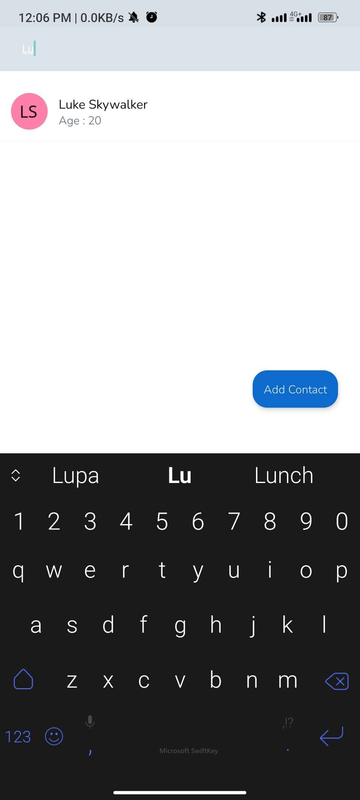
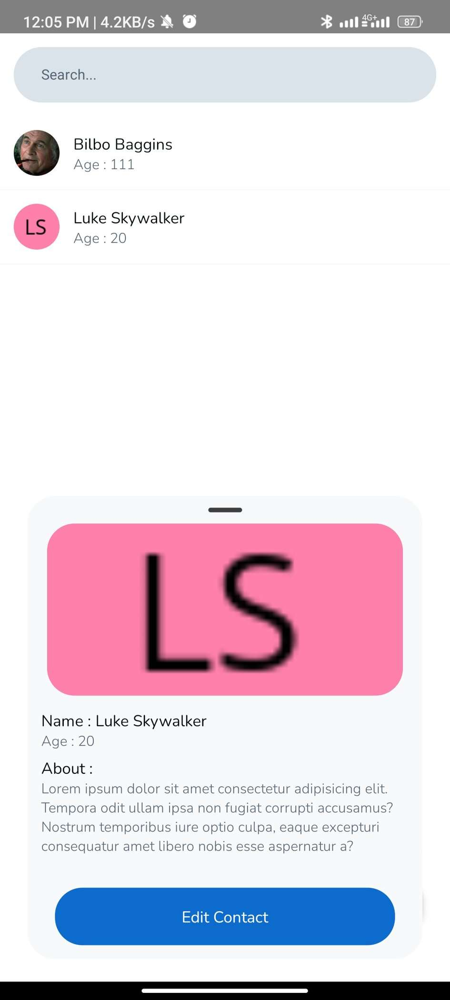
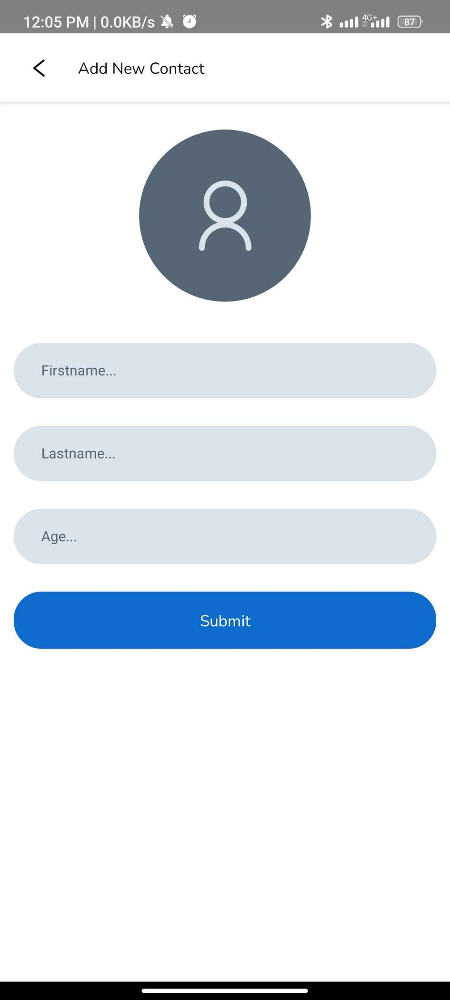
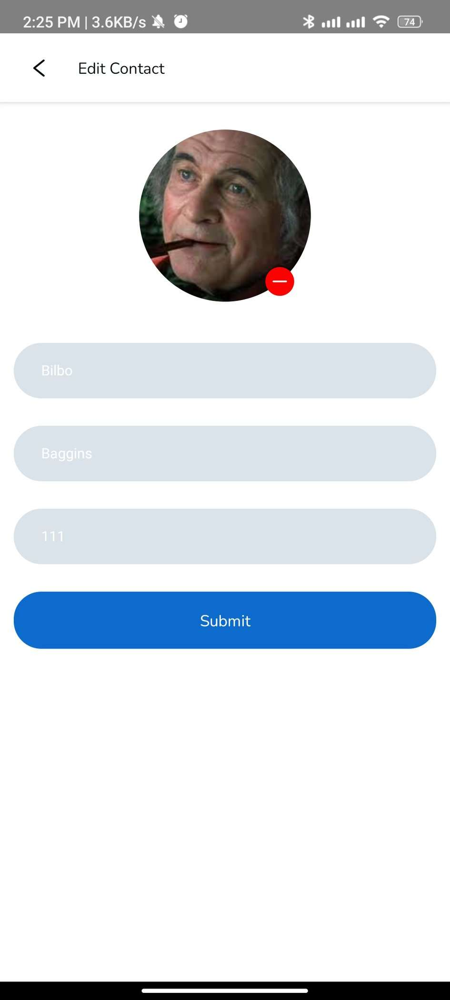

# Iqbal_Apptest

This project is for technical test BTPN Jenius

## Steps to install

Make sure you have set up environtment for development

- clone the repo
- npm install
- npm start
- react-native run-android / react-native npm run-ios

## Preview

| Home Loading             | Home                     | Home Search              |
| ------------------------ | ------------------------ | ------------------------ |
|  |  |  |

| Home View Detail         | Add Contact              | Edit Contact             |
| ------------------------ | ------------------------ | ------------------------ |
|  |  |  |
